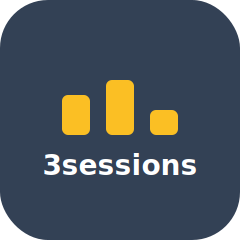
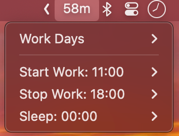

<p align="center">
  
</p>

<h1 align="center">3sessions</h1>
<p align="center">A macOS menu bar timer that countdown your sessions.</p>

<p align="center">
  
</p>

## Timeline

```
Work day:
  🌤️──────────────────💼══════════════════════════════🏠──────────────────😴
       before work                  WORK                    after work
```

- Before work  → countdown to start work
- During work  → countdown to after work
- After  work  → countdown to sleep

---

```
Off day:
  🌤️──────────────────────────────────────────────────────────────────────😴
                                  full day
```

- Countdown all day

## Install

```bash
brew install swiftbar
curl -sL https://raw.githubusercontent.com/tednguyendev/3sessions/main/install.sh | bash
```
